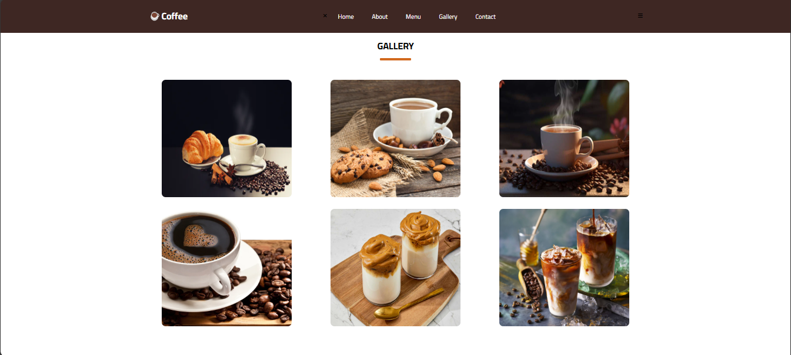
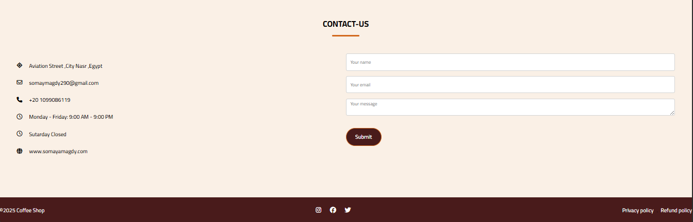

# Coffee Shop Website

## About
This is a simple website for a coffee shop, built using HTML, CSS, and JavaScript.

## Screenshots

**Features:**
* **Menu:** A wide variety of coffee drinks and pastries.
* **About Us:** Learn more about our story and passion for coffee.
* **Gallery:** View beautiful images of our coffee creations.

**Tech Stack:**
* HTML5
* CSS3
* JavaScript

**Getting Started:**
1. Clone the repository: `https://github.com/SomayaAboelola/Coffee-Shop.git`
2. Install dependencies: `npm install`
3. Start the development server: `npm start`

**Contributing:**
Feel free to contribute to this project! Check out our contributing guidelines.